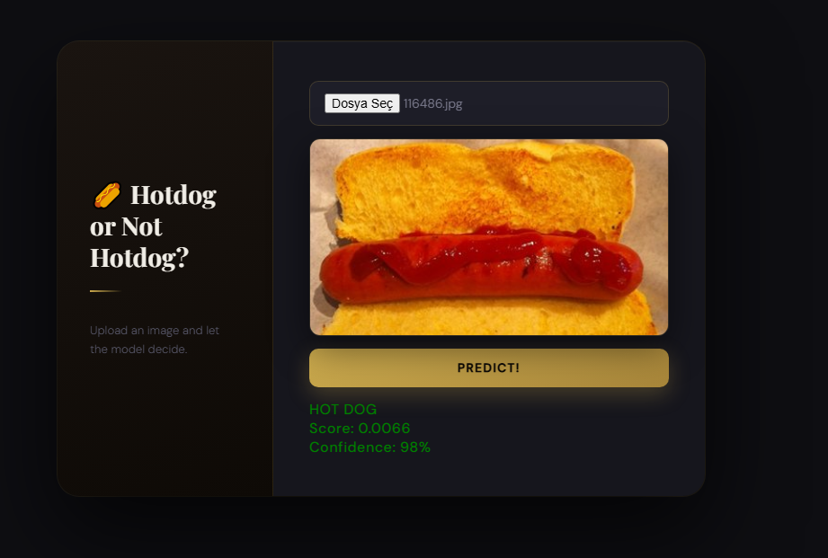
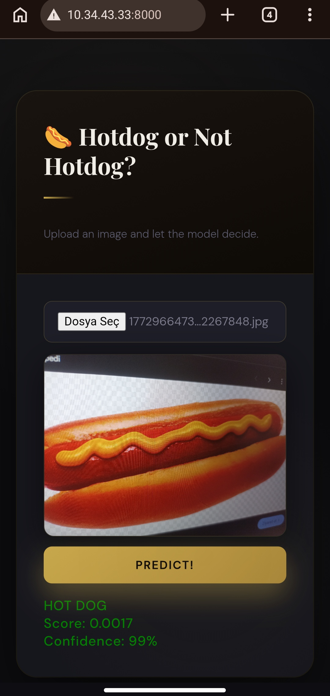

# Hotdog Classifier

A binary image classifier served as a web application. Upload any image and the model will tell you whether it contains a hotdog or not.




## Installation

### Option 1 — Direct Install

```bash
git clone https://github.com/zyr1on/HotDog-Or-NotHotDog-Classifier-with-FastAPI.git
cd HotDog-Or-NotHotDog-Classifier-with-FastAPI

pip install -r requirements.txt

python src/app.py
```

### Option 2 — Virtual Environment

```bash
git clone https://github.com/zyr1on/HotDog-Or-NotHotDog-Classifier-with-FastAPI.git
cd HotDog-Or-NotHotDog-Classifier-with-FastAPI

python -m venv .venv

# Linux / macOS
source .venv/bin/activate

# Windows
.venv\Scripts\activate

pip install -r requirements.txt

python src/app.py
```

The application will be available at `http://localhost:8000`.

---

## Usage

Open `http://localhost:8000` in your browser. Select an image file and click **Predict**. The result will show the label (`HOT DOG` or `NOT HOT DOG`) along with the raw confidence score.

To classify images programmatically, send a `POST` request to `/predict` with the image as a multipart file upload. See [API.md](./API.md) for full details.

---

## What This Project Does

The application takes an image as input and classifies it as either a hotdog or not a hotdog. It consists of three parts:

- **Training pipeline** (`train/train_final.py`) — trains a MobileNetV2-based classifier on the Hot Dog - Not Hot Dog dataset using a two-phase transfer learning approach.
- **Inference wrapper** (`src/model_helper.py`) — loads the saved model and handles image preprocessing and prediction.
- **Web server** (`src/app.py`) — a FastAPI application that serves a browser-based UI and exposes a REST endpoint for inference.

A pretrained model is already included at `src/best_hotdog_model.keras`. Running the server works out of the box without any additional training step. Retraining is optional — see the [Training](#training) section below if you want to retrain from scratch.

---

## How the Model Works

The classifier is built on **MobileNetV2**, a lightweight convolutional network pretrained on ImageNet. The original classification head is replaced with a custom binary head (Dense 128 → Dense 1, sigmoid).

Training proceeds in two phases. In the first phase, the MobileNetV2 backbone is frozen and only the new head is trained. In the second phase, the top 30 layers of the backbone are unfrozen and fine-tuned at a lower learning rate. This two-phase approach allows the model to first learn task-specific features in the head before carefully adapting the pretrained backbone.

At inference time, images are resized to 224×224, normalized to [0, 1], and passed through the network. The sigmoid output is thresholded at 0.5 — scores below 0.5 are classified as **HOT DOG**, scores above as **NOT HOT DOG**.

For a detailed breakdown of the architecture, training parameters, and inference pipeline, see [MODEL.md](./MODEL.md).

---

## Requirements

```txt
tensorflow==2.19.0
keras==3.10.0
numpy==2.0.2
Pillow
fastapi[standard]
uvicorn[standard]
scikit-learn
matplotlib
```

---

## Training (Optional)

The pretrained model at `src/best_hotdog_model.keras` is ready to use and no retraining is required to run the server.

If you want to train from scratch, download the [Hot Dog - Not Hot Dog](https://www.kaggle.com/datasets/dansbecker/hot-dog-not-hot-dog) dataset and place it under `train/hot-dog-not-hot-dog/`, then run:

```bash
cd train
python train_final.py
```

After training completes, copy the output model file into `src/`:

```bash
cp train/best_hotdog_model.keras src/best_hotdog_model.keras
```

For full details on the training process see [MODEL.md](./MODEL.md).

---

## Project Structure

```
.
├── src/
│   ├── app.py
│   ├── model_helper.py
│   └── best_hotdog_model.keras
├── train/
│   ├── train_final.py
│   ├── train_old.py
│   └── hot-dog-not-hot-dog/
│       ├── train/
│       │   ├── hot_dog/
│       │   └── not_hot_dog/
│       └── test/
│           ├── hot_dog/
│           └── not_hot_dog/
├── requirements.txt
├── README.md
├── API.md
└── MODEL.md
```

### Mobile ScreenShot


